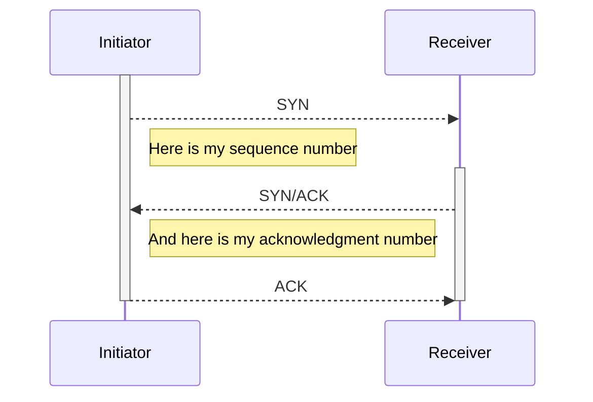

# Packets and Frames

Packets are the piece of data found in layer 3 (Network) of the OSI model, while frames are found in layer 2 (Data Link): the packets result of the encapsulation of frames.

In other words, frames deal with MAC addresses and packets deal with IP addresses.

## TCP/IP (the Three-Way Handshake)

TCP is a *connection-based* protocol: it establishes connection between sending and receiving devices before allowing sending any data.

The main feature of TCP is that it is reliable: it ensures that sent data is actually received, with no alteration. This is made possible thanks to headers contained in thhe packets. Some examples of such headers:

* Source and destination ports
* Checksum
* Sequence and Acknowledgment numbers
* Data

Checksum ensures TCP data integrity and sequence / acknowledgment numbers allow for sending small packets and data reconstruction.

Below is the diagram of a TCP connection is established :

## UDP/IP

UDP is a *stateless protocol*. Since it does not prevent data loss nor data reliability, UDP packets have fewer headers than TCP packets.
